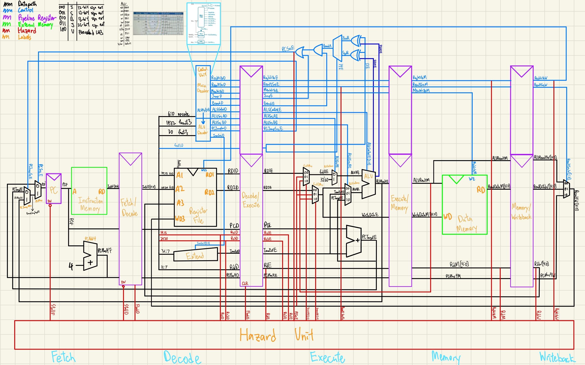
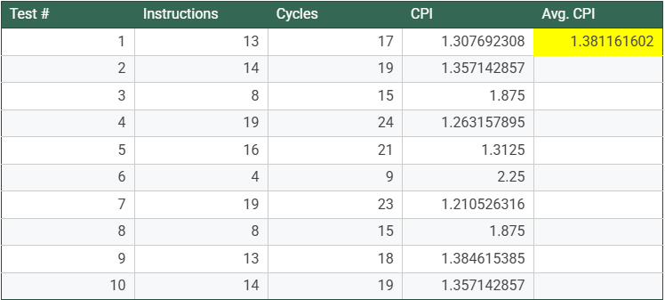
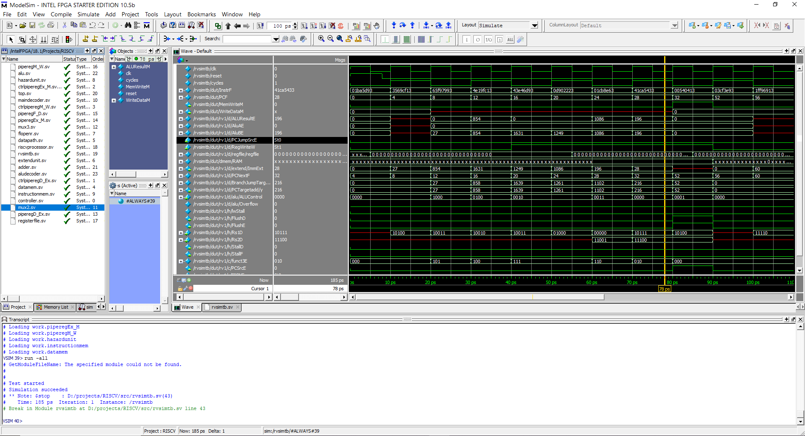

# RISC-V Processor
A 5-stage pipelined processor implemented in SystemVerilog and simulated in ModelSim. Additional Python, C, and Bash scripts
to support verification and automate workflows.

# Features
- 32-bit Instruction
- Implemented 29 integer instructions, including auipc, lui, jalr, beq 
- 5-stage pipeline: fetch, decode, execute, memory, writeback
- Hazard detection unit, implemented forward, flush and stall
- Overflow detection
- Verification tools for constrained random testing
  
# Microarchitecture

# Cycles Per Instruction

# Verification
- tools/instr_gen.py: generates a text file containing a random sequence of riscv instructions, starting with immediate and ending with sw
- tools/reference/main: contains a C program that evaluates a text file of riscv instructions, which outputs evaluated instructions and updates register file, data memory, and program counter. Makefile included
- tools/gen_ref_sync.sh: automates the above two programs to run together 10 times. instr_gen.py instruction text file output is in tools/input/. instr_gen.py console output for all 10 runs in tools/input_log/. Instruction
  evaluation from tools/reference/main stored in tools/output.  
- tools/search_file.sh: run this shell script in the src/ directory to recursively search files for keywords
- To verify processor in ModelSim, update the file being read in src/instructionmem.sv and update ALUM and WriteDataM values in src/rvsimtb.sv for each run. A TCL script is in development to automate this process

  

# Upcoming Changes
- Overflow handling
- Illegal/incorrect instruction handling
- Reduce jump penalty to one cycle by moving PC Target adder to decode stage
  
# References
[1] Digital Design and Computer Architecture RISC-V Edition by Sarah Harris, David Harris
